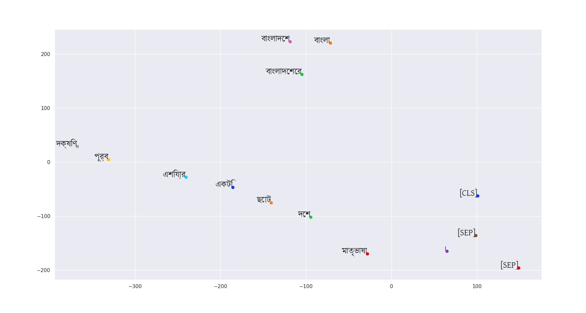

# BanglaVisualization-withBert
A visualization tool that will take in a pair of Bangla sentence and plot the words in a graph.

### Features
<ul>
<li>track which sentence the words are coming from</li>
<li>choose the layers of Bert(out of the 12) to be plotted</li>
<li>choose nearest neighbours</li>
</ul>

### Pre-requisite
<p> Install Pytorch </p>

```
pip3 install torch===1.2.0 torchvision===0.4.0 -f https://download.pytorch.org/whl/torch_stable.html

```
For more information visit: https://pytorch.org/

<p>PyTorch-Transformers can be installed by pip as follows:</p>

```
pip install pytorch-transformers
```
<p>Install the pytorch interface for BERT by Hugging Face. (This library contains interfaces for other pretrained language models like OpenAI’s GPT and GPT-2.)</p>

```
pip install pytorch-pretrained-bert
```
For more information visit: https://github.com/huggingface/pytorch-transformers

Example:
<p align="center">
  <br>
  Figure 1.0
</p>

To run the script

```
python root.py first second
```
